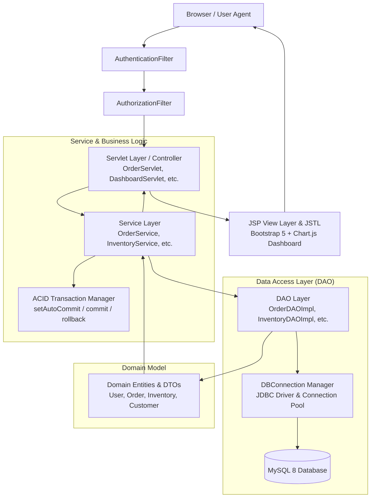
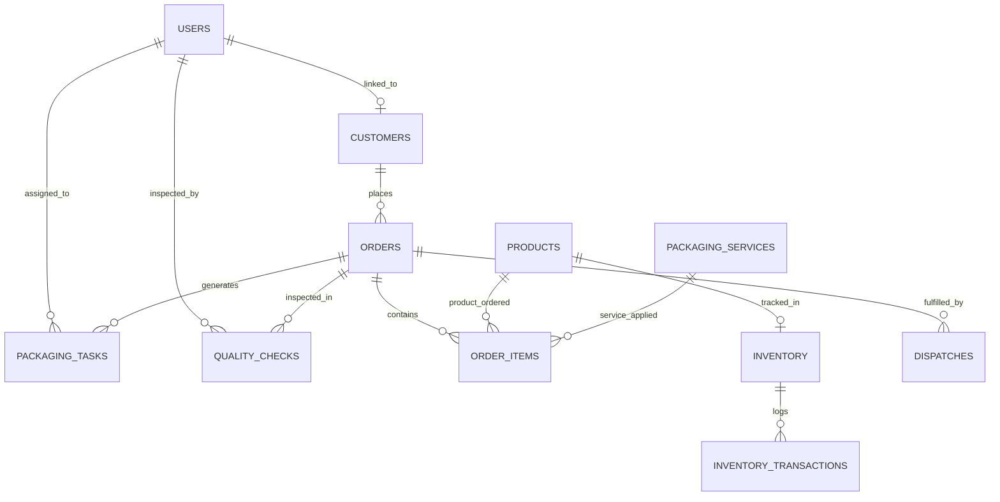

# PackFlow – Smart Packaging & Order Management System

[](https://openjdk.org/)
[](https://tomcat.apache.org/)
[](https://tomcat.apache.org/)
[](https://www.mysql.com/)
[](https://getbootstrap.com/)
[](https://www.chartjs.org/)
[](https://maven.apache.org/)
[](https://junit.org/junit5/)

> A professional enterprise-grade Java Web Application demonstrating classical **Java MVC Architecture**, **Object-Oriented Design**, **Pure JDBC Multi-Table Transactions**, **Role-Based Access Control (RBAC)**, and **Live SQL-Aggregated Analytics** without relying on high-level frameworks like Spring Boot or Hibernate.

---

## 📋 Table of Contents
1. [Project Overview](#-project-overview)
2. [Why Traditional Java Web MVC?](#-why-traditional-java-web-mvc)
3. [Core Feature Highlights](#-core-feature-highlights)
4. [System Architecture](#-system-architecture)
5. [Database Design](#-database-design)
6. [Business Operations & Order Lifecycle](#-business-operations--order-lifecycle)
7. [Technology Stack](#-technology-stack)
8. [Project Structure](#-project-structure)
9. [Installation & Setup Guide](#-installation--setup-guide)
10. [Pre-Seeded Demo Accounts](#-pre-seeded-demo-accounts)
11. [Automated Testing Suite](#-automated-testing-suite)
12. [BSc IT Viva & Technical Interview Defense Guide](#-bsc-it-viva--technical-interview-defense-guide)

---

## 🌟 Project Overview

**PackFlow** is a complete, production-ready contract packaging (Co-Pack) and fulfillment management system built for industrial packaging warehouses. It automates the entire supply chain workflow:

* **Customer Order Placement**: Multi-item line generator combining raw industrial packaging products with value-added packaging services (e.g., bubble wrap cushioning, vacuum sealing, corner guards).
* **Inventory Stock Control**: Available vs. reserved stock tracking, conditional concurrency updates, and automatic reorder thresholds.
* **Warehouse Floor Operations**: Task dispatching, floor assembly status tracking, and quality assurance drop-testing.
* **Dispatch & Logistics**: Carrier assignment, tracking number generation, and delivery confirmation.
* **Dynamic Analytics**: Real-time SQL aggregation for executive KPIs, sales trajectories, status breakdowns, and low-stock alerts. **Zero hardcoded or fake dashboard data.**

---

## 💡 Why Traditional Java Web MVC?

Modern bootcamps often jump straight to high-level frameworks (Spring Boot, Spring Data JPA, Hibernate, React). While productive, this often hides the critical fundamentals of software engineering:
* How HTTP requests traverse filters and servlets.
* How session cookies and state management operate under the hood.
* How relational transactions (`commit` and `rollback`) maintain ACID guarantees.
* How to design clean Object-Oriented polymorphism and DAO abstraction layers.

**PackFlow** purposefully implements pure Java Servlets, JSP, JSTL, and JDBC to demonstrate mastery of Core Java, OOP principles, design patterns, and relational database integrity.

---

## 🚀 Core Feature Highlights

### 1. 100% Real Dynamic Dashboard (No Fake Data)
* Executive KPI cards (Total Orders, Total Revenue, Active Tasks, Low Stock Alerts) queried directly via SQL aggregation functions (`COUNT`, `SUM`, `COALESCE`).
* **5 Interactive Chart.js Visualizations**:
  * Orders by Status Distribution (Doughnut Chart)
  * Monthly Order Volume Trajectory (Bar Chart)
  * 6-Month Revenue Trend (Smooth Area Line Chart)
  * Warehouse Inventory Health (Stacked Bar Chart)
  * Top Packaging Services Utilization (Horizontal Bar Chart)
* Live Low Stock Alert table with instant reorder triggers.

### 2. Multi-Role RBAC Security Architecture
* **Admin**: Complete system oversight, user role administration, inventory creation, financial reports, order approvals, and system auditing.
* **Manager**: Operations management, order review and stock reservation, task assignment, quality inspection logging, and courier dispatch.
* **Customer**: Self-service portal to create packaging orders, review pricing estimates, monitor visual order progress, view invoices, and manage company profiles.
* Protected by **`AuthenticationFilter`** and **`AuthorizationFilter`** matching URL patterns against polymorphic permissions.

### 3. Atomic ACID Inventory Reservation
* Eliminates race conditions with conditional SQL decrement:
  ```sql
  UPDATE inventory 
  SET quantity_available = quantity_available - ?, 
      quantity_reserved = quantity_reserved + ? 
  WHERE inventory_id = ? AND quantity_available >= ?
  ```
* Transactions wrap order approval; if even one item in a multi-item order lacks stock, the entire operation throws `InsufficientInventoryException` and rolls back cleanly.
* Cancelling an order automatically returns reserved stock to the available pool.

### 4. End-to-End Packaging Operations
* **Packaging Services Catalog**: Supports custom handling services (Thermal Insulation, Fragile Cushioning, Anti-Static ESD Wrapping) with unit pricing and estimated handling times.
* **Task Management**: Floor workers update task progress (`PENDING` -> `IN_PROGRESS` -> `COMPLETED`).
* **Quality Check (QC)**: Inspectors verify drop-test, box sealing, and dimensional limits with Pass/Fail/Rework outcomes.
* **Logistics Dispatch**: Integrates courier assignment (FedEx, DHL, BlueDart, UPS) with tracking ID generation.

---

## 🏛 System Architecture

PackFlow adheres to classical layered Java Enterprise MVC:



---

## 🗄 Database Design

The relational schema comprises **11 normalized tables** (3NF) designed with foreign key constraints, unique indexes, and audit logs.



*For complete data dictionary and indexing details, refer to [Database Design Documentation](docs/database-design.md).*

---

## 🔄 Business Operations & Order Lifecycle

Orders transition through a strict finite state machine:

```
[PENDING] ──────> [APPROVED] ──────> [PROCESSING] ──────> [QUALITY_CHECK] ──────> [DISPATCHED] ──────> [DELIVERED]
    │                 │                   │                     │
    ▼                 ▼                   ▼                     ▼
[CANCELLED]       [CANCELLED]         [CANCELLED]           [CANCELLED]
(No Stock)      (Stock Released)    (Stock Released)      (Stock Released)
```

*For comprehensive lifecycle descriptions, refer to [Business Workflow Documentation](docs/business-workflow.md).*

---

## 💻 Technology Stack

| Component | Technology | Version | Purpose |
|---|---|---|---|
| **Language** | Java (OpenJDK) | 17 LTS | Core backend logic, collections, OOP |
| **Web Container** | Apache Tomcat | 9.x / 10.x | Servlet 4.0 runtime container |
| **Servlet API** | `javax.servlet-api` | 4.0.1 | Controller and request/response lifecycle |
| **View Engine** | JSP & JSTL | 2.3 / 1.2 | Server-side template rendering |
| **Database** | MySQL / MariaDB | 8.0+ / 10.4+ | Relational persistence & SQL aggregations |
| **Database Driver**| `mysql-connector-j` | 8.3.0 | JDBC 4.2 connectivity |
| **Security** | `jbcrypt` | 0.4 | Password salting and hashing |
| **Serialization** | `gson` | 2.10.1 | Chart.js dataset JSON serialization |
| **Styling & UI** | Bootstrap & FontAwesome | 5.3.3 / 6.5.1 | Responsive modern enterprise UI |
| **Visual Charts** | Chart.js | 4.4.2 | Interactive Canvas data visualization |
| **Build Tool** | Apache Maven | 3.9+ | Dependency management and `.war` packaging |
| **Testing** | JUnit Jupiter | 5.10.2 | Unit and integration test suite |

---

## 📁 Project Structure

```text
PackFlow/
├── pom.xml                               # Maven Project Descriptor
├── .gitignore                            # Git Exclusion Rules
├── database/
│   ├── schema.sql                        # DDL Script (11 Normalized Tables)
│   └── seed.sql                          # Comprehensive Realistic Seed Data
├── docs/
│   ├── architecture.md                   # System Architecture & Design Patterns
│   ├── database-design.md                # ERD, Table Dictionary & SQL Joins
│   ├── business-workflow.md              # State Machine & Fulfillment Lifecycle
│   └── testing.md                        # Test Suite & Execution Matrix
└── src/
    ├── main/
    │   ├── java/com/packflow/
    │   │   ├── controller/               # 15 HTTP Servlets (Controllers)
    │   │   ├── dao/                      # 13 DAO Interfaces
    │   │   │   └── impl/                 # 13 JDBC DAO Implementations
    │   │   ├── exception/                # Custom Domain Exceptions
    │   │   ├── filter/                   # Authentication & Authorization Filters
    │   │   ├── model/                    # Domain Entities & Polymorphic Users
    │   │   ├── service/                  # Business Logic & ACID Transactions
    │   │   └── util/                     # DBConnection, PasswordUtil, Enums
    │   ├── resources/
    │   │   ├── db.properties             # Active Database Connection Settings
    │   │   └── db.properties.example     # Configuration Template
    │   └── webapp/
    │       ├── WEB-INF/
    │       │   ├── web.xml               # Deployment Descriptor & Error Pages
    │       │   └── partials/             # Reusable header, footer, sidebar, navbar
    │       ├── css/style.css             # Enterprise Theme & Dashboard Styling
    │       ├── dashboard.jsp             # Dynamic Chart.js Analytics Dashboard
    │       ├── orders.jsp                # Paginated Order List & Status Filters
    │       ├── order-details.jsp         # Order Timeline, Line Items & Modals
    │       ├── create-order.jsp          # Interactive Multi-Line Order Creator
    │       ├── inventory.jsp             # Stock Overview, Reorder & Adjustment
    │       ├── products.jsp              # Packaging Material Catalog
    │       ├── packaging-services.jsp    # Packaging Value-Add Services
    │       ├── tasks.jsp                 # Floor Packaging Tasks
    │       ├── quality-checks.jsp        # QA Inspections & Drop-Test Records
    │       ├── dispatches.jsp            # Courier Handover & Tracking
    │       ├── reports.jsp               # Financial & Movement Analytics
    │       ├── customers.jsp             # Customer Directory
    │       ├── users.jsp                 # Admin User Management
    │       ├── profile.jsp               # Current User Profile
    │       ├── login.jsp                 # Secure Sign-In with 1-Click Credentials
    │       ├── unauthorized.jsp          # HTTP 403 Forbidden Error Page
    │       ├── 404.jsp                   # HTTP 404 Not Found Error Page
    │       └── 500.jsp                   # HTTP 500 Internal Error Page
    └── test/java/com/packflow/
        ├── service/                      # Unit & Transaction Integration Tests
        └── util/                         # DB & Security Verification Tests
```

---

## 🛠 Installation & Setup Guide

### Prerequisites
1. **Java Development Kit (JDK 17 or higher)**
2. **Apache Maven (3.8+)**
3. **MySQL Server (8.0+) or MariaDB (10.4+)**
4. **Apache Tomcat 9.x or 10.x**

---

### Step 1: Clone the Repository
```bash
git clone https://github.com/your-username/PackFlow.git
cd PackFlow
```

---

### Step 2: Set Up the Database
Log into MySQL and execute the schema and seed scripts:

```bash
mysql -u root -p -e "CREATE DATABASE packflow_db CHARACTER SET utf8mb4 COLLATE utf8mb4_unicode_ci;"
mysql -u root -p packflow_db < database/schema.sql
mysql -u root -p packflow_db < database/seed.sql
```

---

### Step 3: Configure Database Connection
Edit `src/main/resources/db.properties` with your MySQL credentials:

```properties
db.url=jdbc:mysql://localhost:3306/packflow_db?useSSL=false&allowPublicKeyRetrieval=true&serverTimezone=UTC
db.user=root
db.password=your_mysql_password
db.driver=com.mysql.cj.jdbc.Driver
db.pool.maxTotal=20
db.pool.maxIdle=10
db.pool.minIdle=2
```

---

### Step 4: Run Automated Tests
Verify that all 15 unit and integration tests pass:

```bash
mvn test
```

---

### Step 5: Build the WAR File
Package the application into an enterprise Web Archive (`.war`):

```bash
mvn clean package
```

The compiled archive is generated at:
`target/packflow.war`

---

### Step 6: Deploy to Apache Tomcat
1. Copy `target/packflow.war` to your Apache Tomcat `webapps/` directory:
   ```bash
   cp target/packflow.war $CATALINA_HOME/webapps/
   ```
2. Start Apache Tomcat:
   - **Windows**: `%CATALINA_HOME%\bin\startup.bat`
   - **Linux/macOS**: `$CATALINA_HOME/bin/startup.sh`
3. Open your browser and navigate to:
   ```
   http://localhost:8080/packflow/
   ```

*(Note: If deploying directly in Eclipse / IntelliJ / NetBeans, select "Run on Server" with Apache Tomcat 9).*

---

## 🔑 Pre-Seeded Demo Accounts

The database comes pre-populated with realistic operational data and hashed passwords:

| Role | Email | Password | Access Level |
|---|---|---|---|
| **Admin** | `admin@packflow.com` | `admin123` | Full System Control, Users, Inventory, Approvals, Financial Reports |
| **Manager** | `manager@packflow.com` | `manager123` | Operations, Order Approvals, QC, Dispatches, Floor Tasks |
| **Customer** | `apex@retail.com` | `customer123` | Place Packaging Orders, View Tracking, Monitor Invoices |

*(Quick test helper: The login screen includes 1-click credential auto-fill buttons for immediate testing).*

---

## 🧪 Automated Testing Suite

PackFlow includes an automated JUnit 5 test suite covering financial algorithms, state validation, security encryption, and live transactional rollbacks:

```text
[INFO] -------------------------------------------------------
[INFO]  T E S T S
[INFO] -------------------------------------------------------
[INFO] Running com.packflow.service.InventoryStockLogicTest
[INFO] Tests run: 3, Failures: 0, Errors: 0, Skipped: 0
[INFO] Running com.packflow.service.OrderCostCalculationTest
[INFO] Tests run: 4, Failures: 0, Errors: 0, Skipped: 0
[INFO] Running com.packflow.service.OrderStatusTransitionTest
[INFO] Tests run: 3, Failures: 0, Errors: 0, Skipped: 0
[INFO] Running com.packflow.service.OrderWorkflowIntegrationTest
[INFO] Tests run: 2, Failures: 0, Errors: 0, Skipped: 0
[INFO] Running com.packflow.util.DBConnectionTest
[INFO] Tests run: 1, Failures: 0, Errors: 0, Skipped: 0
[INFO] Running com.packflow.util.PasswordUtilTest
[INFO] Tests run: 2, Failures: 0, Errors: 0, Skipped: 0
[INFO] 
[INFO] Results:
[INFO] Tests run: 15, Failures: 0, Errors: 0, Skipped: 0
[INFO] 
[INFO] BUILD SUCCESS
```

---

## 🎓 BSc IT Viva & Technical Interview Defense Guide

If you are presenting **PackFlow** as your BSc IT final year / portfolio project, here are the most common questions examiners ask and how to answer them with authority:

### Q1: Why did you build this using Servlets and JSP instead of Spring Boot?
> **Answer**: *"Spring Boot automates database transactions, dependency injection, and request routing through reflection and annotations. I purposefully chose pure Java Servlets, JSP, and JDBC to demonstrate a foundational understanding of the HTTP request lifecycle, servlet filter chains, manual session tracking, and explicit JDBC transaction management (`setAutoCommit(false)`, `commit()`, and `rollback()`). Understanding these core concepts makes transitioning to any enterprise framework straightforward."*

### Q2: How do you prevent SQL Injection attacks?
> **Answer**: *"All 13 DAO implementations exclusively use parameterized `PreparedStatement`. Query strings use placeholders (`?`) where user inputs are bound using typed setters like `setString()` and `setInt()`. This ensures that user inputs are treated strictly as data literals by the MySQL query planner and cannot alter the SQL grammar."*

### Q3: How do you guarantee inventory consistency during concurrent orders?
> **Answer**: *"First, at the database level, we use an atomic conditional decrement query:
> `UPDATE inventory SET quantity_available = quantity_available - ? WHERE quantity_available >= ?`.
> If two users attempt to approve orders concurrently for the last unit of stock, the database engine enforces row locks; only the first update succeeds while the second fails. Second, all multi-item inventory checks are wrapped in a single JDBC transaction. If any item is unavailable, an `InsufficientInventoryException` is thrown and the entire transaction rolls back cleanly."*

### Q4: How is Role-Based Access Control (RBAC) enforced?
> **Answer**: *"We implement a two-stage filter chain. The `AuthenticationFilter` intercepts requests to verify that an authenticated `User` object exists in the HTTP session. The subsequent `AuthorizationFilter` inspects the request URI and checks whether the authenticated user's polymorphic role permits access (for instance, restricting `/users` to `ADMIN` and `/reports` to `ADMIN` and `MANAGER`). Unauthorized access attempts are rejected with an HTTP 403 Forbidden page."*

### Q5: How is Object-Oriented Polymorphism used in the user model?
> **Answer**: *"We defined an abstract base class `User` with concrete implementations: `Admin`, `Manager`, and `CustomerUser`. Each subclass overrides `hasPermission(String privilege)` and `getDashboardHome()`. This allows the controllers and filters to invoke permissions dynamically without resorting to brittle `instanceof` checks."*

---

## 📄 License
This project is open-source and available under the [MIT License](LICENSE).
