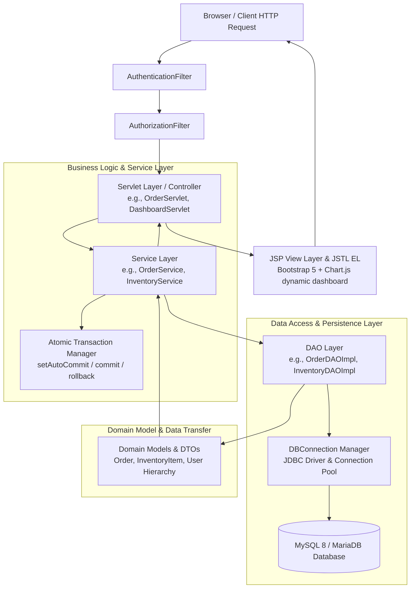
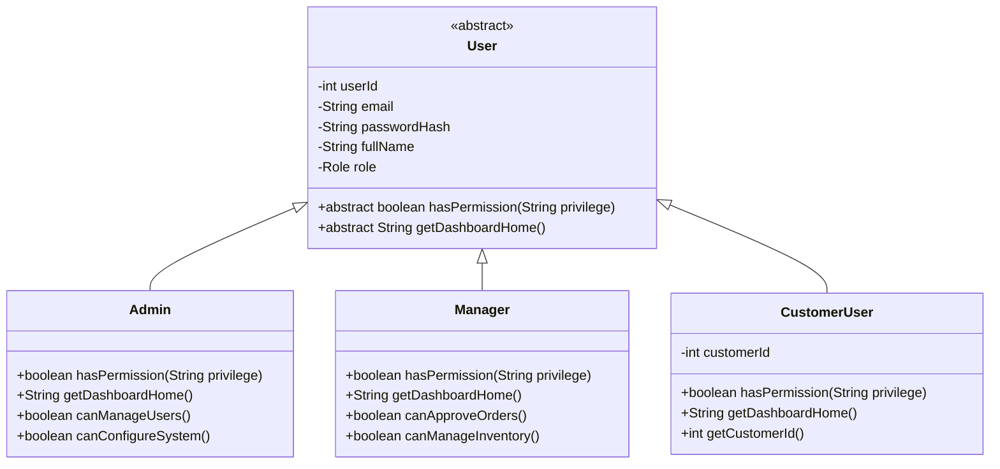

# PackFlow – System Architecture & Design Documentation

## 1. Architectural Overview

**PackFlow** is engineered strictly following the classical **Java Enterprise MVC (Model-View-Controller) Architecture**, adhering to pure enterprise standards without relying on opinionated abstraction frameworks such as Spring Boot or Hibernate. This architecture provides complete transparency into the HTTP request lifecycle, session handling, relational persistence, and clean separation of concerns.



---

## 2. Layered Responsibilities

| Layer | Component Packages | Responsibilities | Technologies |
|---|---|---|---|
| **View** | `src/main/webapp/` | Responsive rendering, client validation, dynamic chart visual displays, user feedback (alerts, badges, modals). | JSP 2.3, JSTL 1.2, Bootstrap 5, Chart.js, Vanilla JS |
| **Filter** | `com.packflow.filter` | Intercepts HTTP requests for session validation, authentication checks, URL-level RBAC role enforcement, and cache control. | `javax.servlet.Filter`, `HttpFilter` |
| **Controller** | `com.packflow.controller` | Parses HTTP query params/POST bodies, coordinates services, sets request/session attributes, and forwards/redirects views. | `javax.servlet.http.HttpServlet` |
| **Service** | `com.packflow.service` | Encapsulates core business rules, multi-table atomic ACID transactions, pricing calculation, state machine validations, and audit logs. | Pure Core Java 17, Collections |
| **DAO** | `com.packflow.dao`, `com.packflow.dao.impl` | Low-level SQL execution, mapping relational `ResultSet` records to Java POJOs, connection acquisition, and SQL error wrapping. | JDBC 4.2 (`PreparedStatement`, `ResultSet`, `DataSource`) |
| **Model** | `com.packflow.model` | Rich domain entities, polymorphic inheritance hierarchy, enumerations, state transition logic, and aggregation DTOs. | Java OOP (Polymorphism, Enums, Encapsulation) |
| **Infrastructure** | `com.packflow.util`, `com.packflow.exception` | Database connection management, BCrypt password security, custom domain checked/unchecked exceptions. | JDBC, BCrypt (`jbcrypt`), Java Logging API |

---

## 3. Object-Oriented Principles & Design Patterns

### 3.1 Inheritance and Polymorphic Role Hierarchy
PackFlow models its authenticated actors through an abstract base class `User` extended by concrete role classes:



- **Polymorphism**: The `User` reference stored in the `HttpSession` allows filters and servlets to uniformly invoke `user.hasPermission(...)` and `user.getDashboardHome()` without checking `instanceof` everywhere.
- **Encapsulation**: All fields are strictly private with validated getters and setters.

### 3.2 State Machine Pattern in `OrderStatus`
The `OrderStatus` enum encapsulates transition rules directly:
- `PENDING` -> `APPROVED`, `CANCELLED`
- `APPROVED` -> `PROCESSING`, `CANCELLED`
- `PROCESSING` -> `QUALITY_CHECK`, `CANCELLED`
- `QUALITY_CHECK` -> `DISPATCHED`, `CANCELLED`
- `DISPATCHED` -> `DELIVERED`
- `DELIVERED`, `CANCELLED` are terminal states.

Attempting an illegal transition triggers a `InvalidStatusTransitionException`, guaranteeing data integrity even if malicious requests are submitted.

### 3.3 Data Access Object (DAO) Pattern
Every entity has an explicit Java Interface in `com.packflow.dao` (e.g., `OrderDAO`) and a JDBC implementation in `com.packflow.dao.impl` (`OrderDAOImpl`). This separates database query implementations from business rules and enables straightforward mocking for unit tests.

### 3.4 Connection Pooling & Factory Pattern
`DBConnection` handles:
- Dynamic configuration loading from `db.properties` (with environment variable fallback).
- Thread-safe JDBC connection vending.
- Centralized helper methods for atomic rollback and resource cleanup (`closeQuietly`).

---

## 4. Security Architecture

### 4.1 Authentication & Session Management
- **BCrypt Encryption**: Passwords are never stored in plaintext. They are hashed using BCrypt with salt rounds (`PasswordUtil.hashPassword()`).
- **Session Hijacking Defense**: On successful authentication, any pre-existing session is invalidated (`session.invalidate()`) and a fresh session is provisioned with `session.setAttribute("currentUser", user)`.
- **Session Timeout**: Enforced to 30 minutes in `web.xml`.

### 4.2 Role-Based Access Control (RBAC) Filter Chain
1. **`AuthenticationFilter`**:
   - Matches all routes `/*`.
   - Bypasses static assets (`/css/*`, `/js/*`, `/images/*`) and public routes (`/login`, `/logout`, `/unauthorized`).
   - If no valid `currentUser` exists in `session`, redirects immediately to `/login` with an informative error flash message.
2. **`AuthorizationFilter`**:
   - Restricts sensitive endpoints according to role:
     - `/users`, `/users/*` -> **ADMIN** only.
     - `/reports`, `/reports/*` -> **ADMIN** and **MANAGER**.
     - `/inventory`, `/tasks`, `/quality-checks`, `/dispatches` -> **ADMIN** and **MANAGER**.
     - `/orders/approve`, `/orders/update-status` -> **ADMIN** and **MANAGER**.
     - `/customers` -> Customer users can view and edit their own customer account; Admins/Managers can manage all.
   - Unauthorized attempts redirect to `/unauthorized.jsp` with HTTP 403 status.

### 4.3 Defense in Depth Against Common Web Vulnerabilities
- **SQL Injection**: 100% of SQL queries in all 13 DAO implementations utilize parameterized `PreparedStatement`. Zero dynamic string concatenation for SQL query parameters.
- **Cross-Site Scripting (XSS)**: All user-controlled text rendered in JSP is rendered using JSTL `<c:out value="${...}"/>` or escaped attributes.
- **Race Conditions**: Critical inventory updates use conditional SQL updates:
  ```sql
  UPDATE inventory 
  SET quantity_available = quantity_available - ?, 
      quantity_reserved = quantity_reserved + ? 
  WHERE inventory_id = ? AND quantity_available >= ?
  ```
  This ensures concurrency safety at the database engine level.
