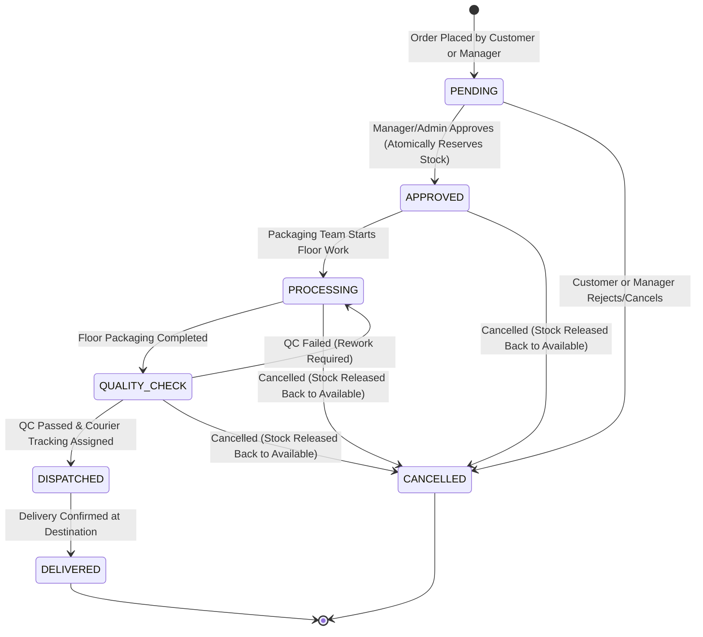

# PackFlow – Business Operations & Order Fulfillment Workflow

## 1. End-to-End Packaging Lifecycle

PackFlow simulates a real-world enterprise contract packaging (Co-Pack) and fulfillment operation. The lifecycle of an order moves through strict state gates verified both in business logic and database constraints.



---

## 2. Step-by-Step Stage Breakdown

### Stage 1: Order Creation (`PENDING`)
- **Actors**: `CUSTOMER`, `MANAGER`, `ADMIN`
- **Actions**:
  - Select Customer (pre-locked to the authenticated customer if logged in as Customer).
  - Add 1 to N line items selecting a Catalog Product and a Value-Added Packaging Service (e.g., Heavy-Duty Double Wall Box + Bubble Cushioning + Foam Corner Protectors).
  - Specify item quantity, priority level, special handling instructions, and requested delivery date.
- **Server-Side Security**:
  - The browser-side preview provides instant price estimation, but the server **never trusts client price submissions**.
  - `OrderService.createOrder()` queries the official unit prices from the database, calculates item line totals, subtotal cost, packaging cost, and order total cost with standard 18% GST/VAT.
  - Automatically generates an enterprise sequence number: `PKG-YYYY-XXXXX`.

---

### Stage 2: Verification & Stock Reservation (`APPROVED`)
- **Actors**: `MANAGER`, `ADMIN`
- **Atomic Operations**:
  - When the manager clicks **"Approve & Reserve Stock"**, an ACID JDBC transaction begins:
    1. System queries the available stock for every line item in the order.
    2. If **any** item lacks sufficient available quantity:
       - An `InsufficientInventoryException` is thrown.
       - The transaction is immediately rolled back via `DBConnection.rollback(conn)`.
       - An alert message is surfaced detailing the missing item and required vs. available quantity.
    3. If all items are available:
       - The SQL update executes:
         ```sql
         UPDATE inventory 
         SET quantity_available = quantity_available - ?,
             quantity_reserved = quantity_reserved + ?
         WHERE inventory_id = ? AND quantity_available >= ?
         ```
       - An audit record is logged in `inventory_transactions` with `transaction_type = 'RESERVE'`.
       - Order status transitions to `APPROVED`.
       - The transaction commits atomically.

---

### Stage 3: Floor Operations & Task Assignment (`PROCESSING`)
- **Actors**: `MANAGER`, `ADMIN`
- **Actions**:
  - Packaging tasks are assigned to warehouse staff (e.g., "Assemble outer boxes", "Apply bubble wrap cushioning", "Seal & barcode pallet").
  - Workers update their task status from `PENDING` to `IN_PROGRESS` and `COMPLETED`.
  - Once floor tasks are complete, the order transitions to `QUALITY_CHECK`.

---

### Stage 4: Quality Inspection (`QUALITY_CHECK`)
- **Actors**: Quality Control Inspectors (`MANAGER`, `ADMIN`)
- **Actions**:
  - Visual and dimensional check against client requirements (drop-test compliance, seal integrity, correct labeling).
  - Record QC Check with outcome:
    - **`PASSED`**: Proceeds to Dispatch. Inventory is consumed (`quantity_on_hand = quantity_on_hand - qty`, `quantity_reserved = quantity_reserved - qty`) with audit type `CONSUME`.
    - **`REWORK_REQUIRED`**: Order returns to `PROCESSING` with corrective instructions.
    - **`FAILED`**: Order paused pending supervisor review.

---

### Stage 5: Fulfillment & Courier Dispatch (`DISPATCHED`)
- **Actors**: Logistics Team (`MANAGER`, `ADMIN`)
- **Actions**:
  - Create Dispatch Record:
    - Select Courier Partner (e.g., FedEx Freight, DHL Express, BlueDart Logistics, UPS Supply Chain).
    - Enter tracking number (or auto-generate a standardized identifier).
    - Shipping label generation and package handover.
  - Order status transitions to `DISPATCHED`.

---

### Stage 6: Final Delivery Confirmation (`DELIVERED`)
- **Actors**: System / Logistics Manager
- **Actions**:
  - Record actual delivery timestamp and recipient signature notes.
  - Order status transitions to `DELIVERED` (Terminal State).

---

### Order Cancellation & Rollback Workflow (`CANCELLED`)
- **Actors**: `MANAGER`, `ADMIN`, or `CUSTOMER` (only before processing)
- **Automatic Rollback Safeguard**:
  - If the order was in `APPROVED`, `PROCESSING`, or `QUALITY_CHECK` state, stock was previously reserved.
  - In a dedicated JDBC transaction, the service layer:
    1. Returns reserved stock:
       ```sql
       UPDATE inventory 
       SET quantity_available = quantity_available + ?,
           quantity_reserved = quantity_reserved - ?
       WHERE inventory_id = ?
       ```
    2. Writes audit log in `inventory_transactions` with `transaction_type = 'RELEASE'`.
    3. Cancels any associated open packaging tasks.
    4. Sets order status to `CANCELLED`.
  - Guarantees zero stock leakage or unaccounted warehouse discrepancies.
