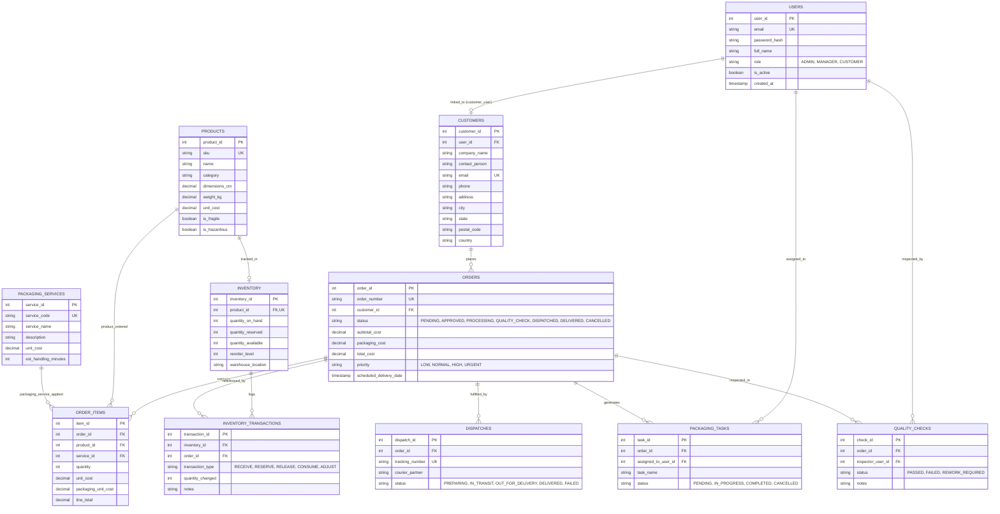

# PackFlow – Database Design & Schema Documentation

## 1. Entity-Relationship Diagram (ERD)

The `packflow_db` database contains 11 normalized tables (3NF) designed to model industrial packaging workflows, material inventory, order fulfillment, quality control, and dispatch tracking.



---

## 2. Table Data Dictionary

### 2.1 `users`
Stores system accounts for role-based authentication.
* **`user_id`**: `INT AUTO_INCREMENT PRIMARY KEY`
* **`email`**: `VARCHAR(150) NOT NULL UNIQUE`
* **`password_hash`**: `VARCHAR(255) NOT NULL` (BCrypt format)
* **`full_name`**: `VARCHAR(100) NOT NULL`
* **`role`**: `ENUM('ADMIN', 'MANAGER', 'CUSTOMER') NOT NULL`
* **`is_active`**: `TINYINT(1) DEFAULT 1`
* **`created_at`**: `TIMESTAMP DEFAULT CURRENT_TIMESTAMP`

### 2.2 `customers`
Stores business customer profiles.
* **`customer_id`**: `INT AUTO_INCREMENT PRIMARY KEY`
* **`user_id`**: `INT NULL` (Foreign Key -> `users.user_id` on delete set null)
* **`company_name`**: `VARCHAR(150) NOT NULL`
* **`contact_person`**: `VARCHAR(100) NOT NULL`
* **`email`**: `VARCHAR(150) NOT NULL UNIQUE`
* **`phone`**: `VARCHAR(25) NOT NULL`
* **`address`**, **`city`**, **`state`**, **`postal_code`**, **`country`**: Address details.

### 2.3 `products`
Industrial packaging catalog items.
* **`product_id`**: `INT AUTO_INCREMENT PRIMARY KEY`
* **`sku`**: `VARCHAR(50) NOT NULL UNIQUE`
* **`name`**: `VARCHAR(150) NOT NULL`
* **`category`**: `VARCHAR(50) NOT NULL`
* **`length_cm`**, **`width_cm`**, **`height_cm`**, **`weight_kg`**: Physical dimensional metrics.
* **`unit_cost`**: `DECIMAL(10, 2) NOT NULL`
* **`is_fragile`**, **`is_hazardous`**: `TINYINT(1) DEFAULT 0`

### 2.4 `packaging_services`
Value-added services applied to order lines (e.g., Bubble Wrap Cushioning, Vacuum Sealing, Thermal Insulation).
* **`service_id`**: `INT AUTO_INCREMENT PRIMARY KEY`
* **`service_code`**: `VARCHAR(50) NOT NULL UNIQUE`
* **`service_name`**: `VARCHAR(100) NOT NULL`
* **`unit_cost`**: `DECIMAL(10, 2) NOT NULL`
* **`est_handling_minutes`**: `INT DEFAULT 15`

### 2.5 `inventory`
Physical warehouse stock tracking.
* **`inventory_id`**: `INT AUTO_INCREMENT PRIMARY KEY`
* **`product_id`**: `INT NOT NULL UNIQUE` (Foreign Key -> `products.product_id`)
* **`quantity_on_hand`**: `INT NOT NULL DEFAULT 0` (Total physical boxes in warehouse)
* **`quantity_reserved`**: `INT NOT NULL DEFAULT 0` (Allocated to approved orders)
* **`quantity_available`**: `INT NOT NULL DEFAULT 0` (`quantity_on_hand - quantity_reserved`)
* **`reorder_level`**: `INT NOT NULL DEFAULT 50`
* **`warehouse_location`**: `VARCHAR(50) NOT NULL` (e.g., `Aisle 3 - Bay B4`)

### 2.6 `orders`
Core customer packaging orders.
* **`order_id`**: `INT AUTO_INCREMENT PRIMARY KEY`
* **`order_number`**: `VARCHAR(30) NOT NULL UNIQUE` (e.g., `PKG-2026-00001`)
* **`customer_id`**: `INT NOT NULL` (Foreign Key -> `customers.customer_id`)
* **`status`**: `ENUM('PENDING', 'APPROVED', 'PROCESSING', 'QUALITY_CHECK', 'DISPATCHED', 'DELIVERED', 'CANCELLED')`
* **`subtotal_cost`**: `DECIMAL(12, 2) NOT NULL`
* **`packaging_cost`**: `DECIMAL(12, 2) NOT NULL`
* **`total_cost`**: `DECIMAL(12, 2) NOT NULL`
* **`priority`**: `ENUM('LOW', 'NORMAL', 'HIGH', 'URGENT')`
* **`special_instructions`**: `TEXT`
* **`scheduled_delivery_date`**: `DATE`

### 2.7 `order_items`
Line items detailing product, quantity, unit price, and packaging service.
* **`item_id`**: `INT AUTO_INCREMENT PRIMARY KEY`
* **`order_id`**: `INT NOT NULL` (Foreign Key -> `orders.order_id` ON DELETE CASCADE)
* **`product_id`**: `INT NOT NULL` (Foreign Key -> `products.product_id`)
* **`service_id`**: `INT NOT NULL` (Foreign Key -> `packaging_services.service_id`)
* **`quantity`**: `INT NOT NULL`
* **`unit_cost`**: `DECIMAL(10, 2) NOT NULL`
* **`packaging_unit_cost`**: `DECIMAL(10, 2) NOT NULL`
* **`line_total`**: `DECIMAL(12, 2) NOT NULL`

---

## 3. High-Value SQL Joins & Aggregations

### 3.1 Order Cost Calculation with Service Aggregations
When orders are loaded, `OrderDAOImpl` joins `orders`, `customers`, and calculates item counts dynamically:
```sql
SELECT o.*, c.company_name, c.contact_person, c.email AS customer_email,
       COUNT(oi.item_id) AS total_items,
       COALESCE(SUM(oi.quantity), 0) AS total_quantity
FROM orders o
JOIN customers c ON o.customer_id = c.customer_id
LEFT JOIN order_items oi ON o.order_id = oi.order_id
GROUP BY o.order_id, c.company_name, c.contact_person, c.email
ORDER BY o.created_at DESC;
```

### 3.2 Low Stock Alert Query
Used in the executive dashboard to dynamically display inventory levels that breach threshold:
```sql
SELECT i.*, p.name AS product_name, p.sku, p.category, p.unit_cost
FROM inventory i
JOIN products p ON i.product_id = p.product_id
WHERE i.quantity_available <= i.reorder_level
ORDER BY (i.quantity_available - i.reorder_level) ASC;
```

### 3.3 Monthly Revenue Aggregation
Generates the real-time financial trajectory chart for Chart.js:
```sql
SELECT DATE_FORMAT(created_at, '%b %Y') AS month_label,
       COALESCE(SUM(total_cost), 0) AS total_revenue,
       COUNT(order_id) AS order_count
FROM orders
WHERE status != 'CANCELLED' 
  AND created_at >= DATE_SUB(CURRENT_DATE(), INTERVAL 6 MONTH)
GROUP BY DATE_FORMAT(created_at, '%b %Y'), YEAR(created_at), MONTH(created_at)
ORDER BY YEAR(created_at) ASC, MONTH(created_at) ASC;
```

---

## 4. Atomic Transaction Management

PackFlow enforces **ACID** (Atomicity, Consistency, Isolation, Durability) guarantees using manual JDBC transaction demarcation:

```java
Connection conn = DBConnection.getConnection();
try {
    conn.setAutoCommit(false);
    
    // 1. Validate status transition
    // 2. Atomically reserve inventory items
    // 3. Insert audit log records in inventory_transactions
    // 4. Update order status to APPROVED
    
    conn.commit();
} catch (Exception e) {
    DBConnection.rollback(conn);
    throw new DatabaseException("Transaction failed and was rolled back", e);
} finally {
    DBConnection.closeQuietly(conn);
}
```

This prevents orphaned reservations or half-completed status changes if an unexpected server or database glitch occurs.
